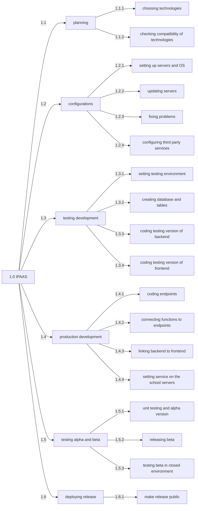
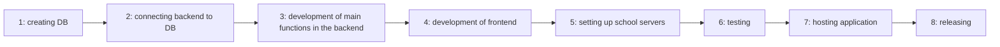
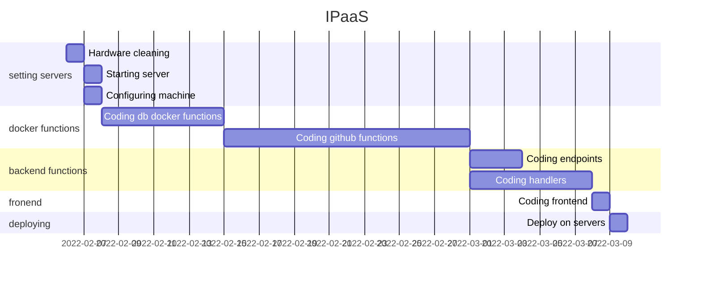
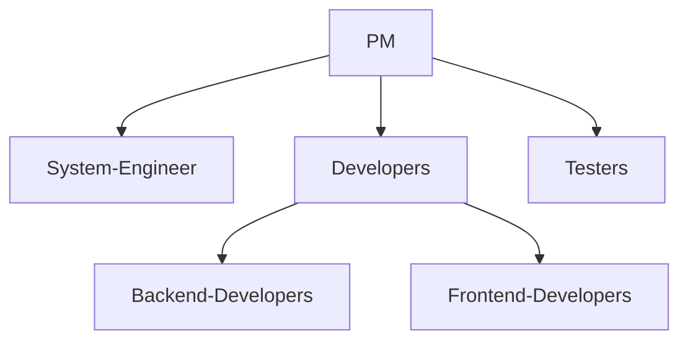

# IPaaS: ITIS Paleocapa as a Service

IPaaS is a hosting service for the [ITIS Paleocapa](https://www.itispaleocapa.edu.it/) and it will let the students host their web-base application on the school servers.

## WBS

## PDM

## GANTT

## OBS

## RACI
A = approve the work
R = person in charge
C = person that collaborates
I = informed of the work done
| activity | PM | system engineer | be dev | fe dev | tester |
|--|--|--|--|--|--|
| configuring servers | A | R | I | I |  |
| setting testing environment | A | I | R | I | C |
| creating db | A | C | R | I | I |
| coding backend | A |  | R | I |  |
| coding frontend | A |  | I | R | C |
| unit testing | A | I | R | C | C |
| testing beta | A/C |  | C | C | R |
| deploying release | A | R | C | I | I |
| make release public | A/R | C | C | C | C |
