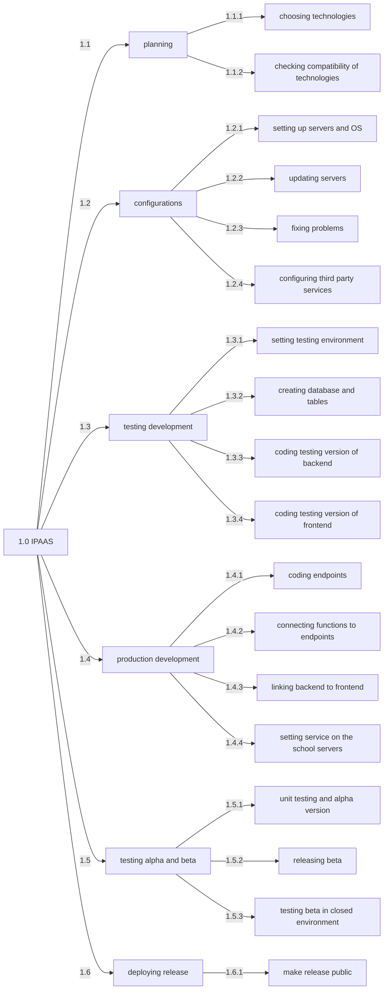
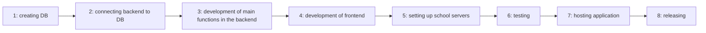
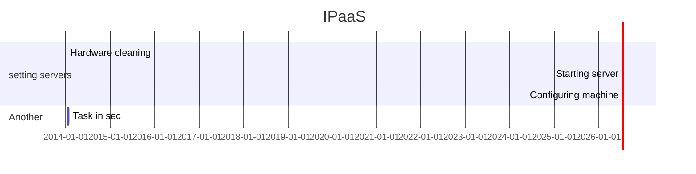

# IPaaS: ITIS Paleocapa as a Service

IPaaS is a hosting service for the [ITIS Paleocapa](https://www.itispaleocapa.edu.it/) and it will let the students host their web-base application on the school servers.

## WBS

## PDM

## GANTT
> https://mermaid-js.github.io/mermaid/#/gantt

