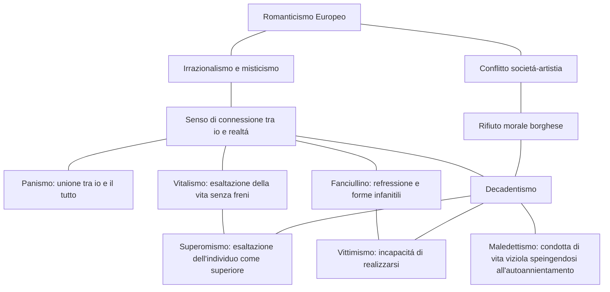

## Scapigliatura:
il termine nasce da Cleto arrighi nel romando *la scapigliatura* (era la traduzione di bohéme).
gli scagliati erano degli scrittori attivi a milano che avevano come filosofia l'insofferenza per la mentalitá comtemporanea.
Gli scapigliati erano contro il concetto di modernitá dell'espoca perché esaltava il progresso scientifico e il profitto, questi poeti tendono quindi a rappresentare il vero nell'aspetto piú materiale possibile utilizzando un metodo analitico e il linguaggio scientifico del positivismo.
Oltre a questi aspetti questa corrente assume aspetti relativi al romanticismo e prende tematica come l'irrazionalitá e il gusto per il macabro (fosca, l'attrazione per la donna, la donna fatale).
> ## Poeti Scapigliati:
- Arrigo Boito: 
	--- 
	La scapigliatura fu un breve periodo della sua vita, la sua poetica si basa sul concetto di *dualismo* tra ideale e realtá, tra bene e male quale, tra l'altro, é la condizione degli scapigliati.
	> testi fatti:
	- **Case nuove**: in questo testo Boito parla del suo disapprovo riguardo la demolizione di alcune case storiche per far posto a quelle piú moderne.
	Per esprimere i suoi sentimenti usa dei termini che indicano idee negative (strage, ruina, ...), una delle motivazioni per il dissenso é il perdere il senso del bello e far posto al nuovo solo perché é nuovo; inoltre dice che queste demolizioni servono solo a scopo di lucro quindi un altra motivazione.

- Ugo Tarchetti:
	---
	Fin da giovane si dedica alla letteratura ma muore giovane in miseria.
	Le tematica da lui affrontate sono tematiche *nere* (spiritismo e macabro).
	>testi fatti:
	- **L'attrazione della morte**: questo testo é tratto dalla sua opera piú importante, *Fosca*, il testo riguarda una donna affascinante che attrae Giorgio ma per via di una malattia nervosa della donna questa porterá alla distruzione della vita di Giorgio.
	La malattia viene descritta in modo scientifico e medico da corretta poesia scapigliata ma la donna ha l'immagine della morte e della voglia di distruggere l'uomo.
	In questo testo si vede il concetto del piacere dato dalla sofferenza e l'ossessione della morte che sono dei tempi cari a Tarchetti.
	Tarchetti descrive il rapporto come una tortura per l'uomo ma questo é anche un punto di piacere per quest'ultimo.

## Positivismo e Naturalismo Francese
Il naturalismo é una corrente che nasce in Francia nella seconda metá dell'800, é caratterizzato da una fiducia verso la scienza siccome questa é l'unica conoscenza possibile (secondo loro tutti i campi del sapere devono applicare il metodo scientifico).
Secondo il positivismo la scienza ha il compito di studiare le leggi della natura in modo da ottenere un progresso materiale (in Italia prenderá il nome di verismo siccome descrive il vero).
Questo periodo deriva dalle 2 rivoluzioni industriali (Baudelaire dice che questo periodo é solo un progresso morale infatti il positivismo era parallelo al decadentismo)
> ## Poeti Positivisti e Naturalisti:
- Gustave Flaubert, Madame Bovary:
	---
	Flaubert venne considerato un punto di riferimento per il naturalismo, il suo tipo di narrazione é distaccata ed impersonale.
	Questo implica che il narratore non interviene all'interno della storia come invece succedeva nel romanzo ottocentesco ma il racconto ha il punto di vista del protagonista (questa tecnica sará ripresa e raffinata da Verga)
	> testi fatti:
	- **Madame Bovary**: uno dei testi piú importanti di Flaubert é Madame Bovary, questo romanzo é la storia di una ragazza di provincia che é spostata con un medico che lavora a Parigi.
	Il testo parla della vita vuota e grigia della ragazza perché non é in grado di andare a Parigi e vivere la vita della grande cittá ma deve subire quella della sposa di campagna che aspetta il marito per la cena.
	I temi chiave del testo sono l'insofferenza per la vita di provincia ed il contrasto tra sogno e realtá; come visto prima questi sono temi che richiamano la scapigliatura ed i Bohéme nonostante questo poeta faccia parte della corrente del naturalismo (come detto prima, il naturalismo e positivismo andavano di pari passo con il decadentismo).
	Nel romanzo si cita spesso il sogno dato dalla letteratura visto che Emma (la protagonista) aveva come unica forma di immaginazione la lettura ed il racconto di quei posti in cui non é mai potuta andare.
	Flaubert non si limita ad analizzare la condizione psicofisica della donna ma analizza l'aspetto emotivo di questa impersonificandosi nella donna stessa e raccontando quindi i suoi pensieri e punti di vista.

- Emile Zola 
	--- 
	 Zolá tra tutti i naturalisti é colui che da una sistemazione piú concreta a questa corrente, esprimerá la teoria della sua narrativa nel testo *romanzo sperimentale*, in questo testo verranno raccontante le teorie ed il manifesto della scuola naturalista.
	 > testi fatti
	 - **L'alcol inonda Parigi**: Questo testo é un estratto da *L'Assommoir* quale é ambientato nella Parigi operaia e parla dell'alcolismo, miseria e degradazione umana.
	 Questo romanzo era anche un esperimento stilistico che assumeva le teorie descritte nel *romanzo sperimentale*.
	 Il titolo del romanzo indica il nome in gergo francese dell'osteria in cui si beveva acquavite, infatti nella prefazione di tale Zola dice che vuole racchiudere *la lingua del popolo* in questo testo.
	 L'estratto (l'alcol inonda Parigi) é narrato all'interno dell'*Assommoir* e tratta di Gervasia che é disgustata dall'odore delle pipe e dell'alcol e considerava quest'ultimo un veleno peró aveva il desiderio di bere quel veleno perché le dava piacere.
	 Dopo l'assunzione dell'alcol la sua percezione cambia e, prima era disgustata dagli uomini ubriachi e del luogo in cui si trovava ma dopo le iniziava a sembrare un posto caldo ed accogliente.
	 Questo testo tratta della piega dell'aclolismo e del degrado ed ipocrisia della societá.
	 Il linguaggio utilizzato nel test mostra vasti utilizzi del gergo dei proletari (non si vede tanto nella traduzione...) peró viene utilizzato solo quando i personaggi parlano o pensano ma per descrivere l'ambiente e tutti quegli elementi narrati da Zola allora il linguaggio cambia e torna colto.
	 Uno degli aspetti piú importanti peró é la regressione della mentalitá e modo di esprimersi in base ai personaggio che Zola sta narrando (questo sará uno dei punti principali della letteratura di Verga).

## Etá vittoriana
La societá inglese ha un enorme sviluppo industriale e scientifico nell'800.
Questo periodo di sviluppo peró crea una scissione enorme tra borghesia e classe povera, la borghesia diventa sempre piú ricca grazie al trionfo industriale mentre per la classe povera diventa quasi impossibile diventare indipendente.
Questa realtá divenne il tema chiave della scrittura realista inglese nella quale eccelse principalmente *Charles Dickens*.
La scrittura di questo periodo mostra una tendenza a rappresentare la realtá con un fine umoristico caricando i personaggi.
> ## Poeti Vittoriani:
- Charles Dickens:
	---
	Charles Dickens fu il migliore a capire la borghesia del tempo, i temi principali da lui trattati furono la critica della societá siccome non era un rivoluzionario e la sua scrittura sentimentale e melodrammatica.
	> testi fatti:
	- **La cittá industriale**:  In questo testo Dickens ha un tono ironico e sarcastico con la quale denuncia la condizione degli operai che erano vittime del sistema economico industriale/
	In questo testo inoltre fa vedere subito uno dei suoi temi principali ovvero la critica della societá perché gli uomini vengono considerati merci e cose.
	Il tono ironico viene usato nella descrizione della cittá e indica la bruttezza di questo paesaggio 
	

## Poesia Simbolista
### Mappa dal romanticismo al decadentismo e sotto correnti

### Poesia simbolista in Francia ed Italia
| **paese** | **caratteristiche** | **autori** |
|-- | -- | -- |
| Francia | Poesia suggestiva ed evocativa, linguaggio analogico, denso e simboleggiante cose oscure | Baudleaire, Mallarmé
| Italia | Ricerca di richiamano alla realtá misteriosa, importante la musicalitá nelle parole, ha un linguaggio analogico e trascura nessi logici | Pascoli, D'Annunzio

### Naturalismo e Decadentismo
| Naturalismo |  | Decadentismo |
|--|--| -- 
| Realtá regoalta da sistemi spiegabili razionalmente | Ideologia | Realtá pervasa dal mistreo dell'ignoto |
| Serie di fatti oggettivi | Intreccio | Eventi soggettivi e scarsa trama
| Molti personaggi, psicologia si mescola all'ambiente | Personaggi | Singolo protagonista con una psicologia complessa |
| Descrizione dettagliata | Ambientazione | Descritti solo aspetti necessari
| Temi riguardo la realtá sociale contemporanea | Temi | Temi irrazionali, legati al rapporto tra artista e societá

	
## Verismo Italiano
Zola ebbe un grande successo in Italia e si diffuse la figura del romanziere scienziato anche detto *realista*.
Le teorie di Zola verranno riprese solamente da *Luigi Capuana* e *Giovanni Verga*.
	
> ## Poeti Veristi:
- Luigi Capuana
  ---
	Capuana fu il primo a rielaborare la teoria del naturalismo ma esso dice che la scientificitá si puó dimostrare solo con la scelta dei mezzi espressivi inspirati dall'impersonalitá della narrazione.
	> opere fatte:
	- **Scienza e forma letteraria: l'impersonificazione**: In questo testo Capuana parla della sua distanza dal *romanzo sperimantale* di Zola e mostra come l'arte e la letteratura per lui non devono diventare scienza ma rimanere tali e seguire i loro solitu fini artistici.
	Un altro aspetto importante relativo al testo ed ai concetti di Capuana é il principio dell'impersonalitá.
	L'impersonalitá per l'autore é la scomparsa di quest'ultimo dall'opera stessa in modo da reprimere interventi soggettivi.
- Giovanni Verga:
	---
	Verga fu colui che consolidó la corrente del verismo italiano, la sua narrazzione viene definita *mimetica* perché é in grado di completamente estraniarsi dal racconto ed immedesimarsi non solo nei personaggi stessi ma nella loro mente e sentimenti.
	I suoi testi spesso parlano di opposizioni tra veri aspetti sociali/sentimentali o fisici, in un suo testo tratta dell'amore ed ambiente romantico della campagna e lo mette a confronto con la cittá che é un territorio freddo e veloce, tutto questo ovviamente avviene in maniera distaccata vista la sua teoria e scrittura mimetica.
	> punti principali:
	- impersonalitá
	- refressione dal punto di vista narrativo
	- riduzione del racconto all'essenziale
	- rifiuto della drammaticitá
	- rapporti cause/effetto sulla psicologia del personaggio
