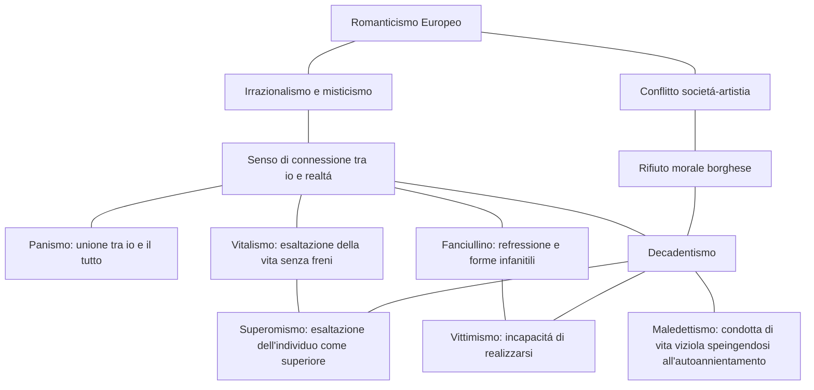

# ITALIANO PROGRAMMA COMPLETO
# Indice
1. [Scapigliatura](#scapigliatura)
	1. [Arrigo Boito](#boito)
		1. [Case nuove](#case-nuove)
	2. [Ugo Tarchetti](#tarchetti) 
		1. [L'attrazione della morte](#attrazione-della-morte)
 2. [Positivismo e Naturalismo Francese](#positivismo-naturalismo)
	1.  [Gustave Flaubert](#flaubert)
		1. [Madame Bovary](#bovary)
	2. [Emile Zola](#zola)
		1. [L'alcol inonda Parigi](#parigi)
3. [Etá Vittoriana](#vittoriana)
	1. [Charles Dickens](#dickens)
		1. [La cittá industriale](#industriale)
4. [Poesia Simbolisa](#simbolista)
	1. [Mappa da romanticismo al decadentismo](#mappa-romanticismo-decadentismo)
	2. [Poesia simbolista in Francia ed Italia](#simbolista-francia-italia)
	3. [Naturalismo e Decadentismo](#naturalismo-decadentismo)
5. [Verismo Italiano](#verismo)
	1. [Luigi Capuana](#capuana)
		1. [Scienza e forma letteraria: l’impersonificazione](#impersonificazione)
	2. [Giovanni Verga](#verga)
6. [Decadentismo](#decadentismo)
	1. [Charles Baudleaire](#baudleaire)
		1. [Corrispondenze](#corrispondenze)
		2. [Albatro](#albatro) 
7. [D'Annunzio](#dannunzio)
	1. [Un ritratto allo specchio, Andrea Sperelli ed Elena Muti](#sperelli)
	2. [La pioggia nel pineto](#pineto)
8. [Pascoli](#pascoli)
	1. [X Agosto](#agosto)
	2. [Novembre](#novembre)
9. [Futurismo](#futurismo)
	1. [Filippo Tommaso Marinetti](#marinetti)
		1. [Manifesto del Futurismo](#manifesto)
		2. [Manifesto tecnico della letteratura futurista](#manifesto-tecnico)
10. [Italo Svevo](#svevo)
	1. [Una vita](#vita)
	2. [I tre inetti](#inetti)
	3. [I tre romanzi a confronto](#inetti)
	4. [Le ali del gabbiano](#gabbiano)
	5. [Il ritratto dell'inetto](#ritratto-inetto)
	6. [Il fumo](#fumo)
11. [Pirandello](#pirandello)
	1. [Un'arte che scompone il reale](#arte-scompone-reale)
	2. [Il treno ha fischiato](#treno)
	3. [Nessun nome](#no-name)
12. [Ermetismo](#ermetismo)
	1. [Quasimodo](#quasimodo)
		1. [Ed é subito sera](#sera)
		2. [Alle fronde dei salici](#salici)
	2. [Ungaretti](#ungaretti)
		1. [Fratelli](#fratelli)
		2. [Veglia](#veglia)
	3. [Montale](#montale)
		1. [Meriggiare pallido e assorto](#meriggiare)

---

## Scapigliatura: 
il termine nasce da Cleto arrighi nel romando *la scapigliatura* (era la traduzione di bohéme).
gli scagliati erano degli scrittori attivi a milano che avevano come filosofia l'insofferenza per la mentalitá comtemporanea.
Gli scapigliati erano contro il concetto di modernitá dell'epoca perché esaltava il progresso scientifico e il profitto, questi poeti tendono quindi a rappresentare il vero nell'aspetto piú materiale possibile utilizzando un metodo analitico e il linguaggio scientifico del positivismo.
Oltre a questi aspetti questa corrente assume aspetti relativi al romanticismo e prende tematica come l'irrazionalitá e il gusto per il macabro (fosca, l'attrazione per la donna, la donna fatale).
> ## Poeti Scapigliati:
- Arrigo Boito: 
	--- 
	La scapigliatura fu un breve periodo della sua vita, la sua poetica si basa sul concetto di *dualismo* tra ideale e realtá, tra bene e male quale, tra l'altro, é la condizione degli scapigliati.
	> testi fatti:
	- **Case nuove**: in questo testo Boito parla del suo disapprovo riguardo la demolizione di alcune case storiche per far posto a quelle piú moderne.
	Per esprimere i suoi sentimenti usa dei termini che indicano idee negative (strage, ruina, ...), una delle motivazioni per il dissenso é il perdere il senso del bello e far posto al nuovo solo perché é nuovo; inoltre dice che queste demolizioni servono solo a scopo di lucro quindi un altra motivazione.

- Ugo Tarchetti: 
	---
	Fin da giovane si dedica alla letteratura ma muore giovane in miseria.
	Le tematica da lui affrontate sono tematiche *nere* (spiritismo e macabro).
	>testi fatti:
	- **L'attrazione della morte**: questo testo e tratto dalla sua opera piú importante, *Fosca*, il testo riguarda una donna affascinante che attrae Giorgio ma per via di una malattia nervosa della donna questa porterá alla distruzione della vita di Giorgio.
	La malattia viene descritta in modo scientifico e medico da corretta poesia scapigliata ma la donna ha l'immagine della morte e della voglia di distruggere l'uomo.
	In questo testo si vede il concetto del piacere dato dalla sofferenza e l'ossessione della morte che sono dei tempi cari a Tarchetti.
	Tarchetti descrive il rapporto come una tortura per l'uomo ma questo é anche un punto di piacere per quest'ultimo.

## Positivismo e Naturalismo Francese 
Il naturalismo é una corrente che nasce in Francia nella seconda metá dell'800, é caratterizzato da una fiducia verso la scienza siccome questa é l'unica conoscenza possibile (secondo loro tutti i campi del sapere devono applicare il metodo scientifico).
Secondo il positivismo la scienza ha il compito di studiare le leggi della natura in modo da ottenere un progresso materiale (in Italia prenderá il nome di verismo siccome descrive il vero).
Questo periodo deriva dalle 2 rivoluzioni industriali (Baudelaire dice che questo periodo é solo un progresso morale infatti il positivismo era parallelo al decadentismo)
> ## Poeti Positivisti e Naturalisti:
- Gustave Flaubert:
	---
	Flaubert venne considerato un punto di riferimento per il naturalismo, il suo tipo di narrazione é distaccata ed impersonale.
	Questo implica che il narratore non interviene all'interno della storia come invece succedeva nel romanzo ottocentesco ma il racconto ha il punto di vista del protagonista (questa tecnica sará ripresa e raffinata da Verga)
	> testi fatti:
	- **Madame Bovary**: uno dei testi piú importanti di Flaubert é Madame Bovary, questo romanzo é la storia di una ragazza di provincia che é spostata con un medico che lavora a Parigi.
	Il testo parla della vita vuota e grigia della ragazza perché non é in grado di andare a Parigi e vivere la vita della grande cittá ma deve subire quella della sposa di campagna che aspetta il marito per la cena.
	I temi chiave del testo sono l'insofferenza per la vita di provincia ed il contrasto tra sogno e realtá; come visto prima questi sono temi che richiamano la scapigliatura ed i Bohéme nonostante questo poeta faccia parte della corrente del naturalismo (come detto prima, il naturalismo e positivismo andavano di pari passo con il decadentismo).
	Nel romanzo si cita spesso il sogno dato dalla letteratura visto che Emma (la protagonista) aveva come unica forma di immaginazione la lettura ed il racconto di quei posti in cui non é mai potuta andare.
	Flaubert non si limita ad analizzare la condizione psicofisica della donna ma analizza l'aspetto emotivo di questa impersonificandosi nella donna stessa e raccontando quindi i suoi pensieri e punti di vista.

- Emile Zola 
	--- 
	 Zolá tra tutti i naturalisti é colui che da una sistemazione piú concreta a questa corrente, esprimerá la teoria della sua narrativa nel testo *romanzo sperimentale*, in questo testo verranno raccontante le teorie ed il manifesto della scuola naturalista.
	 > testi fatti
	 - **L'alcol inonda Parigi**: Questo testo é un estratto da *L'Assommoir* quale é ambientato nella Parigi operaia e parla dell'alcolismo, miseria e degradazione umana.
	 Questo romanzo era anche un esperimento stilistico che assumeva le teorie descritte nel *romanzo sperimentale*.
	 Il titolo del romanzo indica il nome in gergo francese dell'osteria in cui si beveva acquavite, infatti nella prefazione di tale Zola dice che vuole racchiudere *la lingua del popolo* in questo testo.
	 L'estratto (l'alcol inonda Parigi) é narrato all'interno dell'*Assommoir* e tratta di Gervasia che é disgustata dall'odore delle pipe e dell'alcol e considerava quest'ultimo un veleno peró aveva il desiderio di bere quel veleno perché le dava piacere.
	 Dopo l'assunzione dell'alcol la sua percezione cambia e, prima era disgustata dagli uomini ubriachi e del luogo in cui si trovava ma dopo le iniziava a sembrare un posto caldo ed accogliente.
	 Questo testo tratta della piega dell'aclolismo e del degrado ed ipocrisia della societá.
	 Il linguaggio utilizzato nel test mostra vasti utilizzi del gergo dei proletari (non si vede tanto nella traduzione...) peró viene utilizzato solo quando i personaggi parlano o pensano ma per descrivere l'ambiente e tutti quegli elementi narrati da Zola allora il linguaggio cambia e torna colto.
	 Uno degli aspetti piú importanti peró é la regressione della mentalitá e modo di esprimersi in base ai personaggio che Zola sta narrando (questo sará uno dei punti principali della letteratura di Verga).

## Etá Vittoriana 
La societá inglese ha un enorme sviluppo industriale e scientifico nell'800.
Questo periodo di sviluppo peró crea una scissione enorme tra borghesia e classe povera, la borghesia diventa sempre piú ricca grazie al trionfo industriale mentre per la classe povera diventa quasi impossibile diventare indipendente.
Questa realtá divenne il tema chiave della scrittura realista inglese nella quale eccelse principalmente *Charles Dickens*.
La scrittura di questo periodo mostra una tendenza a rappresentare la realtá con un fine umoristico caricando i personaggi.
> ## Poeti Vittoriani:
- Charles Dickens: 
	---
	Charles Dickens fu il migliore a capire la borghesia del tempo, i temi principali da lui trattati furono la critica della societá siccome non era un rivoluzionario e la sua scrittura sentimentale e melodrammatica.
	> testi fatti:
	- **La cittá industriale**:  In questo testo Dickens ha un tono ironico e sarcastico con la quale denuncia la condizione degli operai che erano vittime del sistema economico industriale/
	In questo testo inoltre fa vedere subito uno dei suoi temi principali ovvero la critica della societá perché gli uomini vengono considerati merci e cose.
	Il tono ironico viene usato nella descrizione della cittá e indica la bruttezza di questo paesaggio 

## Poesia Simbolista 
### Mappa dal romanticismo al decadentismo e sotto correnti 

### Poesia simbolista in Francia ed Italia 
| **paese** | **caratteristiche** | **autori** |
|-- | -- | -- |
| Francia | Poesia suggestiva ed evocativa, linguaggio analogico, denso e simboleggiante cose oscure | Baudleaire, Mallarmé
| Italia | Ricerca di richiamano alla realtá misteriosa, importante la musicalitá nelle parole, ha un linguaggio analogico e trascura nessi logici | Pascoli, D'Annunzio

### Naturalismo e Decadentismo 
| Naturalismo |  | Decadentismo |
|--|--| -- 
| Realtá regoalta da sistemi spiegabili razionalmente | Ideologia | Realtá pervasa dal mistreo dell'ignoto |
| Serie di fatti oggettivi | Intreccio | Eventi soggettivi e scarsa trama
| Molti personaggi, psicologia si mescola all'ambiente | Personaggi | Singolo protagonista con una psicologia complessa |
| Descrizione dettagliata | Ambientazione | Descritti solo aspetti necessari
| Temi riguardo la realtá sociale contemporanea | Temi | Temi irrazionali, legati al rapporto tra artista e societá

## Verismo Italiano 
Zola ebbe un grande successo in Italia e si diffuse la figura del romanziere scienziato anche detto *realista*.
Le teorie di Zola verranno riprese solamente da *Luigi Capuana* e *Giovanni Verga*.
	
> ## Poeti Veristi:
- Luigi Capuana 
  ---
	Capuana fu il primo a rielaborare la teoria del naturalismo ma esso dice che la scientificitá si puó dimostrare solo con la scelta dei mezzi espressivi inspirati dall'impersonalitá della narrazione.
	> opere fatte:
	- **Scienza e forma letteraria: l'impersonificazione**: In questo testo Capuana parla della sua distanza dal *romanzo sperimantale* di Zola e mostra come l'arte e la letteratura per lui non devono diventare scienza ma rimanere tali e seguire i loro solitu fini artistici.
	Un altro aspetto importante relativo al testo ed ai concetti di Capuana é il principio dell'impersonalitá.
	L'impersonalitá per l'autore é la scomparsa di quest'ultimo dall'opera stessa in modo da reprimere interventi soggettivi.
- Giovanni Verga: 
	---
	Verga fu colui che consolidó la corrente del verismo italiano, la sua narrazzione viene definita *mimetica* perché é in grado di completamente estraniarsi dal racconto ed immedesimarsi non solo nei personaggi stessi ma nella loro mente e sentimenti.
	I suoi testi spesso parlano di opposizioni tra veri aspetti sociali/sentimentali o fisici, in un suo testo tratta dell'amore ed ambiente romantico della campagna e lo mette a confronto con la cittá che é un territorio freddo e veloce, tutto questo ovviamente avviene in maniera distaccata vista la sua teoria e scrittura mimetica.
	> punti principali:
	- impersonalitá
	- refressione dal punto di vista narrativo
	- riduzione del racconto all'essenziale
	- rifiuto della drammaticitá
	- rapporti cause/effetto sulla psicologia del personaggio

## Decadentismo 
La corrente decadente andava di pari passo con quella positivistica, questa corrente un irrazionalismo che considerava il reale come una rete di analogie misteriose, il punto peró dice che queste analogie non potevano essere analizzate scientificamente (ecco perché andava contro al positivismo), potevano essere colte solo dall'intuizione umana.
In questo periodo i poeti decadenti si sentono esclusi dalla societá siccome rifiutano la cultura di massa per continuare a seguire la loro teoria (dedicarsi completamente all'arte).
> temi del decadentismo:
- attrazione dagli stati anormali della coscienza (malattie mentali, allucinazioni, disturbi,...)
- aspetti oscuri della realtá (corruzione, perfersione)
- temi provocatori/taboo (lussuria, morte)

In questo periodo nasce anche il concetto del vitalismo e superomismo.
> ## Poeti Decadenti
- Charles Baudleaire 
  --- 
  Baudleaire ha una concenzione *mistica* della realtá ed il senso che il nostro *io* ha con il *tutto* (**Panismo**), la sua poesia inoltre indica una concezione non razionale della realtá che evidenzia maggiormente il pensiero decadente riguardo al distacco dalla ragione e razionalitá umana.
  Inoltre Baudleaire tratta il simbolismo e il maledettismo (perché rifiuta i valori borghesi della morale corrente), queste 3 correnti assieme formano il cocnetto di decadentismo.
  > Opere fatte:
  - **Corrispondenze**: La poesia fa parte dei *I fiori del male* in cui si vede il concetto dello *spleen* e *ideal* (la rosa con i fiori).
  In questa poesia si vede la visione del mondo e del reale in modo mistico, viene detto come le forme materiali della natura non sono altro che simboli di una realtá piú profonda che non compete la scienza, questa realtá forma una serie di legami miseriosi quali uniscono tutti gli elementi naturali.
  In questa poesia per evidenziare questi elementi/collegamenti si usa molto lo studio dei sensi, ad esempio la descrizione degli odori, colori e sapori.
  - **Albatro**: L'albatro mostra il dualismo della societá quale Baudleaire voleva denunciare, la poesia parla di un albatro che di per se é il re del mare ma quando viene catturato dai marinai questo viene deriso per il suo corpo sporporzionato, questa é un evidente critica a coloro che sono in grado di volare alto ma quanto si trovano sullo stesso piano di quelli che non capiscono finiscono con l'essere derisi per il loro essere fuori misura in quel contesto (Baudleaire usa il poeta come esempio)

## D'Annunzio 
D'Annunzio fu considerato un genio della letteratura, fin da piccolo pubblicó testi che divennero subito famosi.
Le sue liriche mortano una tendenza estetizzante in cui trova il flusso decandente, D'Annunzio crea l'arte come valore supremo alla quale tutti sono subordinati, qui nasce il superomismo.
L'estetismo dannunziano é sempre alla ricerca del bello, scriverá *il piacere* che sará appunto l'opera che mostrerá meglio questa sua ideologia ma, dopo questo testo, D'Annunzio ebbe una fase di stanchezza e si ripiega su sentimenti e fatti intimi.

D'Annunzio rifiutava i valori borghesi, questo con l'aggiunta delle influenze decandenti lo portano e creare il concetto dell'**estetismo** quale é l'esaltazione del bello contro l'utile e l'arte come valore assoluto, questo concetto lo si vedrá nel *piacere*, da qui derivano: l'**edonismo** (l'arte é fonte di piacere) e, dopo un isolamente dell'artista dalla societa borghese e alcune influenze da altre correnti lo portano a definire il **superomismo** quale indica l'esaltazione dell'individuo e tutto il resto ne é subordinato (come l'estetismo ma per l'uomo stesso).
 
> testi fatti:
- **Un ritratto allo specchio, Andrea Sperelli ed Elena Muti**: il testo é tratto da *il piacere* e i temi chiave sono la critica all'estetismo, la sensualitá ed il vizio.
Anche questo testo non tratta solo i personaggi in se ma ne descrive anche il loro discorso interiore peró, a differenza di Verga o di Zola, D'Annunzio traspare durante il racconto siccome si trovano vari commenti che fanno capire che sono raccontati da una voce onniscente.
- **La pioggia nel pineto**: questa poesia fa parte dell *Alcyone* e mostra come la poesia venga trasformata in musica, lo studio e corrispondenza delle parole con l'essenza delle cose e soprattutto **la fusione tra l'uomo e la natura che portano ad una vita oltreumana**. 

## Pascoli 
La visione pascoliana del mondo rispecchia la crisi del positivismo siccome c'é una profonda sfiducia nella scienza come mezzo per l'interpretazione della realtá (**decadentismo**).
Pascoli introduce un punto di vista nuovo perché dice che il mondo era un luogo frantumanto (siccome é stato emarignato contro la sua volontá ed ora non riesce piú a rientrare nel mondo che tutti stavano vivendo).
Il mondo per pascoli é un posto incomprensibile, non ne capisce il significato, la sua poetica si baserá non su un quadro logico ma su elementi simbolici e allusivi per far intenderne un significato piú profondo.
Da qui nasce il concetto del *fanciullino* in cui Pascoli si paragona ad un fanciullo che non é in grado di vedere il mondo in modo razionale siccome é visto dagli occhi di un bambino, esso infatti parlerá alla realtá al posto di descriverla e questo lo porterá a trovarne singificati nuovi.
> testi fatti:
- **X Agosto**: questa poesia richiama una tragedia personale (la morte del padre) e Pascoli trova una correlazione tra la morte avvenuta il 10 agosto e la notte di San Lorenzo (stesso giorno).
In questa poesia si possono trovare diversi elementi simbolici che richiamano aspetti religiosi (non la religione in se) e cita il problema del male del mondo che é inguaribile.
Il lessico é studiato perché le parole hanno un senso intriseco che, se analizzate, mostrano il senso della poesia da un lato piú profondo.
- **Novembre**: La poesia tratta della realtá frutto dell'immaginazione, l'immagine simbolica della morte e la distruzione della sintassi.
p 479 (sono stanco)

 ## Futurismo 
 Il futurismo era una corrente nata agli inizi del '900 e aveva alla base della sua teoria i valori della potenza, del coraggio quali rappresentano la pienezza della vita e il movimento e dinamismo.
 Il futurismo disprezza il classico perché viene vista come finzione (infatti distruggeranno musei ed elementi che rappresentavano il classicismo).
 Con il futurismo la macchina diventa diventa sia il mezzo che il fine della creativitá artistica/esteta (uomo meccanico che trionfa sulla guerra).
 La scrittura futurista era semplice e veloce senza forme lessicali forbite (il loro tipo di scrittura inoltre richiamava il fasismo).
 
 > ## Poeti Futuristi
 - Filippo Tommaso Marinetti Futurismo 
   ---
    Tommaso Marinetti scrisse *Il manifesto del futurismo* e lo pubblicó per la prima volta su un giornale francese *Le Figaro*, questo manifesto enunciava le teorie futuriste, una volta pubblicato Marinetti continuó ad esporre il futurismo al mondo e questo si estese fino in Italia ed altri paesi europei, da qui nacquero i movimenti avanguardisti.
    Marinetti voleva dar voce non alla psicologia umana ma alla materia, infatti nei suoi testi userá termini per descrivere odori, pesi e rumori (cambia dimensione del carattere, spazi per descrivere pause sonore, ...)
    > testi fatti:
    - **Manifesto del Futurismo**: Il manifesto del futurismo fu il testo scritto da Marinetti che diede inizio al futurismo, fu pubblicato sul *figaro* (giornale parigino), questo testo enunciava l'esaltazione al movimento e alla modernitá inoltre criticava il passato e la sua mentalitá.
    Giá da questi temi si poteva vedere come Marinetti fosse esaltato dai temi futuristi, il testo era diviso in punti attraverso una lista numerata, giá da questo aspetto si poteva notare la distruzzione della sintassi e dei temi classici quali non avrebbero mai strutturato un testo come una lista.
    Il significato del manifesto era quello di manifestare i principi del futurismo.
    Il dinamismo viene mostrato quando il testo passa dal piano culturale a quello sportivo per sfociare in violenza.
   - **Manifesto tecnico della letteratura futurista**: Il manifesto tecnico indicava come affrontare la scrittura futurista da un punto di vista tecnico.
   Il testo enuncia ancora con una lista numerata gli elementi da tenere conto per scrivere un testo futurista.
   Alcuni degli elementi descritti sono:
   **distruzione della sintassi**: tutto il testo deve basarsi sul distruttugere la sintassi quale é un elemento classico.
   **verbo all'infinito**: usare i verbi all'infinto distrugge ogni tipo di descrizione temporale quale inutile per la comprensione del testo.
   **eliminazione dell'aggettivo ed avverbio**: questo aspetto serviva per esaltare meglio le cose descritte. 

## Italo Svevo 
Svevo subí diverse suggestioni culturali quali formarono il suo moto di scrivere e pensare.
La corrente **filosofica** viene principalmente da *Schopenhauer* (l'uomo non é libero di scegliere), da *Marx* e *Nietzsche* (la classe sociale condiziona i comportamenti, critica della societá borghese).
La **letteratura** proviene dall'unione del romanzo ingelse, realismo e naturalismo francese e romanzo psicologico quali uniti formano una corrente mista tra umorismo, critica della coscienza, deescrizione minuziona dei personaggi, personaggi inetti e analisi psicologiche dei personaggi.
 Le opere di Svevo mostrano la sua cultura della scienza, le idee di Freud lo portano ad elaborare una concezione pessimistica tra uomo e realtá (l'uomo non é libero perché é condizionato da elementi che non puó controllare).
 > utili da sapere:
 - **una vita**: Il primo romanzo scritto da Svevo é *una vita* ed il protagonista é Alfonso Nitti.
 Il romanzo tratta di quest'uomo che ha alti ideali ma finiranno in confilitto con la societá borghese (tema preso dai realisti francesi).
 Nonostante tutti gli ideali Nitti si rivela non all'altezza di sostenerali e sará destinato al fallimento quale lo portano in una situazione di paralisi.
 In questo romanzo appare la figura cara dell'**inetto**, Nitti si rivela un inetto perché rinuncia di lottare per raggiungere i propri ideali (essenzialmente si arrende alla vita), si arrende ed accetta la sconfitta.
 - **i tre inetti**:: I tre inetti sono i protagonisti dei suoi 3 romanzi (Nitti, Bretani e Cosini), tutti e 3 hanno difficoltá ad affrontare la vita ed incapaci di vivere (sono inetti perché non sono in grado di affrontare la vita, che non vuol'dire siano dei falliti, sono inetti perché smettono di lottare).
  La differenza principale é che gli inetti dei primi due romanzi vanno incontro ad un totale fallimento invece ne *la coscienza di zeno*, Zeno realizza la sua condizione e, cosí facendo, riesce a straniarsi dalla societá e finisce per criticarla.
  - **i tre romanzi a confronto**
 
| | una vita e senilitá | la coscienza di zeno | 
|--|--|--|
| narratore | esterno | coincide con il protagonista |
| focalizzazione | generalmente interna (coincide con il protagonista) ma con interventi del narratore | interna (ogni tanto interventi da Zeno narratore |
| tempo | lineare (tipo fabula) | tempo misto (intreccio a nuclei tematici)
| ambiente sociale | descrizione dettagliata dell'ambiente | l'ambiente é descritto dal punto di vista del protagonista
 > testi fatti:
 - **Le ali del gabbiano**: Il testo é un estratto da *una vita* e racconta di un incontro tra Nitti e Macario (il suo opposto).
 I temi chiave sono l'opposizione tra l'inetto (Nitti) e il suo opposto (Macario), inoltre viene messo in risalto il determinismo di Darwin (evoluzione della specie e selezione naturale).
 Il centro del testo mette a risalto le difficoltá dell'inetto a prendere una posizione siccome ha paura del mare e non riesce a mantenere la calma, invece Macario é esperto e non mostra segni di debolezza, questa situazione portano l'uomo forte a esibire le proprie qualitá opprimento Nitti.
 - **Il ritratto dell'inetto**: Il ritratto dell'inetto é tratto dalla senilitá e parla del concetto di maschere e l'opposizione tra malattia e salute.
 In questo estratto si vede Emilio (protagonista) indossare una maschera superomistica per scappare dalla sua condizione di inettitudine, si crede una macchina geniale in costruzione (non é in grado di vedersi nella sua mediocritá).
- **Il fumo**: il fumo é tratto da *la coscienza di Zeno* e tratta della malattia di Zeno utilizzata come alibi, l'origine del vizio del fumo.
Zeno giustifica la sua inettitudine (vive a 57 anni con l'amministratore, non é un gran che a suonare il violino, non studia o lavora, ...) attraverso la malattia quale secondo lui é data dal fumo.
Dice di voler smettere di fumare per diventare un uomo migliore ma é proprio il fumo che lo porta a giustificare la sua malattia e instaurarsi nella sua personalitá come condizione psicologica.

## Pirandello 
Pirandello nacque in 1867, alla base del suo pensiero c'é la concezione della vita secondo la quale l'uomo e la realtá sono soggetti a costanti trasformazioni.
La sua concezione si basa su due correnti:
- **vitalismo**: secondo la quale l'uomo e la realta sono in continuo cambiamento
- **teoria di Binet**: secondo cui in un individuo ci sono diverse personalitá (no disturbo mentale).

Questi 2 elementi hanno portato Pirandello a definire l'idea de *l'identitá personale* secondo la quale questa non esiste come forma fissa me porta alla definizione di:
- **maschera**: la maschera é definita dalla societá e l'individuo indossa una mascera in base al correre degli eventi
- **trappola**:  la vita é una trappola alla quale si puó evadere solo con l'immaginazione e la follia.

Nei testi di Pirandello viene mostrato come noi (come persona) siamo tanti individui che vengono messi in risalto a seconda della situazione, la presa di coscienza dell'indebolimento dell'io porta nei personaggi dolore a angoscia.
Un altro aspetto caro a Pirandello é il *relativismo coscitivo* ossia la negazione della vertiá come fatto oggettivo, questo significa che ogniuno ha la propria veritá che é definita dal modo in cui questa persona vede il mondo.

Pirandello ha un concetto dell'umorismo nato dal relativismo coscitivo quale secondo lui l'umorismo é l'attidurine a cogliere la differenza tra realtá ed apparenza ovvero il sapere cogliere il sentimento del contrario.
> testi fatti:
- **Un'arte che scompone il reale**: quest'estratto da *l'umorismo* presenta aspetti prettamente riguardanti l'umorismo e viene mostrato come questo sia il sentimento del contrario e manifestazione della realtá moderna.
L'umorismo é l'arte che ha preso consapevolezza della finzione della realtá.
- **Il treno ha fischiato**: Questo testo estratto da *novelle per un anno* tratta della trappola che é il lavoro e la famiglia per il protagonista quale si troverá oppresso da essi e lo porterá ad uno stato di "pazzia" e la scomposizione umoristica della realtá.
La novella tratta di un ambiante lavorativo tipico della piccola borghesia composto da elementi negativi attorno al protagonista.
Nella descrizione dell'ambiante é da notare come l'obiettivo di Pirandello non si quello di rappresentare la realtá ma di estremizzare.
- **Nessun Nome**: tratto da *uno nessuno centomila* questo estratto é la parte conclusiva del romanzo, in questa parte si enuncia il rifiuto della societá e la consapevolezza del vivere attimo per attimo, la fusione dell'io con la natura (panismo).
La condizione del vivere attimo per attimo é una condizione di gioia perché permette alla persona di "rinascere attimo per attimo" impedendo che i brutti pensieri abbiano tempo di nascere nella mente.

## Ermetismo 
la poetica ermetica si sviluppa negli anni 30 e sará capitanata principalmente da:
- Salvatore Quasimodo
- Giuseppe Ungaretti
- Eugenio Montale

Il termine significa chiusure/impenetrabile (deriva da Ermete Trismegisto), questo termine fu utilizzato per indicare l'oscuritá ed ambiguitá espressiva di alcuni poeti che richiamavano il simbolismo.
I punti di riferimento degli ermetisti erano dei caffé a firenze detti "le giubbe rosse" (colore giacca dei camerieri).
L'idea centrale dell'ermetismo é stato il rifiuto della letteratura come illustriazione della politica, storia e cronaca, invece volevano che la poesia fosse un esperienza totalizzante in modo che la persona possa trovare una propria identitá.
Gli ermeti rifiutavano la situazione politica del tempo (fascismo), essi erano l'opposto del futurismo, cercavano una poesia pura (senza inquinamenti politico-civili).
> ## Poeti Ermetici:
- Salvatore Quasimodo
	---
	Quasimodo fu tra i principali esponenti dell'ermetismo, le sue poesia sono incentrate sulla condizione esistenziale dell'uomo, segnata dalla solitudine e dalla precarietá.
	La sua poesia racchiude a pieno il senso dell'ermetismo, una poesia corta con versi liberi ma di complesso e denso significato, il testo doveva essere corto per non diventare prolisso ma doveva racchiudere pienamente il senso da esprimere (le parole erano scelte minuziosamente).
	 > testi fatti:
	 - **Ed é subito sera**: Questa poesia racchiude a pieno il senso di solitudine dell'uomo perché descrive l'uomo come solo giá dal primo termine *ognuno* che fa intuire tutte le persone ma prese singolarmente, poi ne mette in risalto la precarietá quando dice:
		 > trafitto da un raggio di sole:
		 > ed é subito sera   
		 
		 in questo punto della poesia dice che all'uomo basa il calore del sole che li trafigge per diventare sera (morire).
	- **Alle fronde dei salici**: in questa poesia viene mostrato il disprezzo della guerra (appunto perché l'ermetismo era il contrario del futurismo quale era pro guerra).
	Quasimodo inizia la poesia con *E* come se fosse il proseguimento di una frase precedentemente iniziata, questa tecnica serve per far immedesimare maggiormente il lettore e il richiamo dell'io, un altro evento simile lo si ha alla penultima riga in cui dice *anche le nostre cetre* in cui indica che se tutto quello che é successo (la guerra) é anche colpa sua perché parla alla prima persona plurale (era un senso di solidarietá).
	
- Giuseppe Ungaretti
	- 
	Ungaretti fu un altro esponente dell'ermetismo, la sua poetica aveva una sintassi breve con periodi semplici senza artefatti sintattici.
	Il lessico utilizzato presetava un utilizzo di termini fortemente allusivi e l'alto utilizzo di pronomi/aggettivi che evidenziano l'immagine, per quanto riguarda la metrica utilizzava il verso libero con versi brevi.
	> testi fatti
	- **fratelli**: una poesia estratta da *L'allegria* (la sua raccolta piú celebre) mostra la fratellanza umana e la creacrietá della vita di un soldato.
	La poesia é formata da 4 momenti, il primo punto é l'*incipit* quale é una domanda che riguarda l'appartenenza di alcuni confraterni, questo vengono chiamati *fratelli* come se Ungaretti volesse stabilire una solidarietá tra loro e il gruppo di "fratelli" a cui si rivolge.
	La parola tremante indica peró la paura di essere in balia della guerra e del timore di poter morire in qualsiasi momento, specialmente nel caso in cui quel "fratelli" fosse rivolto al nemico.
	- **Veglia**: anche questa poesia tratta della guerra ma tratta anche dell'attaccamento alla vita.
	La poesia si apre con una scena macabra che mostra la crudeltá della guerra (la scena di un compagno martoriato dalla guerra).
	La vera parte fondamentale della poesia é alla fine in cui, dopo una linea vuota che separa dalla descrizione della guerra Ungaretti scrive *non sono mia stato tanto attaccatto alla vita*, questa frase mostra la completa pienezza della voglia di vivere anche in situazioni tremende come la guerra e rappresenta una protesta all'atrocitá della guerra.

- Eugenio Montale: 
	- 
	Montale era l'apoteosi del pessimismo, si allontana completamente dal simbolismo e dal futurismo, secondo lui la poesia non puó liberare l'uomo dalla sua condizione (il malessere) ma lo puó portare ad accettare tale condizione.
	La sua opera piú famosa é *Ossi di seppia* che é una raccolta di poesia che trattano della poetica degli oggetti (oggetti hanno un valore allegorico e metafisico, evocando sentimenti, stati d'animo e diventando emblema del "male di vivere" che contraddistingue la condizione dell'uomo in questo periodo), l'ariditá della condizione umana e disarmonia con la realtá e l'indifferenza come rimedio.
	> testi fatti:
	- **Meriggiare pallido e assorto**: questa poesia é tratta da *ossi di seppia*, il tema principale é l'impossibilitá di cercare la veritá.
	La poesia mostra un momento in cui il tempo sembra essersi fermato e si ha una discussione muta tra l'uomo e le cose.
	(mi sono rotto)
